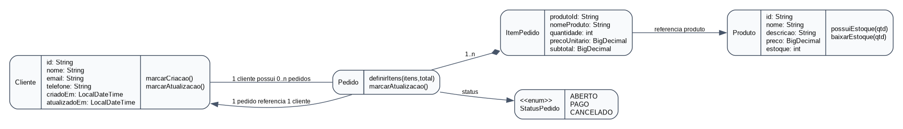
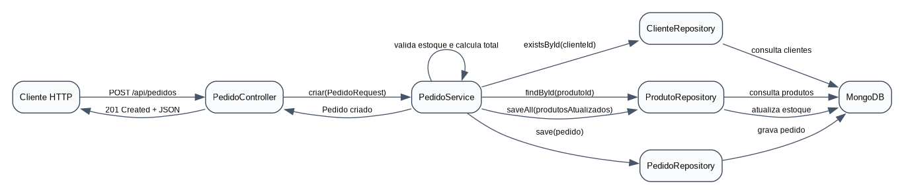

# Entrega academica - Desenvolvimento de Sistemas com RUP e MVC

**Projeto:** Loja MVC MongoDB  
**Aluno:** Rodrigo Tavares Vieira  
**Curso:** Analise e Desenvolvimento de Sistemas  
**Materia:** Desenvolvimento BACK-END  
**Data:** 06/07/2026

## 1. Introducao

Esta atividade apresenta a evolucao de uma aplicacao back-end Java para um sistema web estruturado com o Processo Unificado Rational (RUP) e o padrao arquitetural MVC. O estudo de caso escolhido foi uma loja virtual simplificada, pois ela permite representar entidades reais, relacionamentos e operacoes CRUD de forma clara.

A aplicacao foi implementada em Java com Spring Boot, Spring MVC e Spring Data MongoDB. A persistencia foi transferida para o MongoDB, substituindo o armazenamento em memoria usado na fase anterior. A nova versao possui CRUD para clientes, produtos e pedidos, com regra de negocio para calculo de total e baixa de estoque.

## 2. Estudo de caso escolhido

O estudo de caso e uma loja virtual simplificada, composta por:

- **Cliente:** cadastra dados basicos da pessoa que realiza compras.
- **Produto:** representa itens disponiveis para venda.
- **Pedido:** relaciona um cliente aos produtos comprados.
- **ItemPedido:** representa a quantidade e o subtotal de cada produto dentro de um pedido.

O relacionamento principal ocorre entre `Cliente` e `Pedido`: um cliente pode possuir varios pedidos, enquanto cada pedido pertence a um unico cliente. O pedido tambem possui itens que referenciam produtos.

## 3. Aplicacao do RUP

O RUP organiza o desenvolvimento em quatro fases principais. No contexto deste projeto back-end, essas fases podem ser aplicadas da seguinte forma:

### 3.1 Concepcao

Na fase de concepcao, o objetivo e entender o problema, definir o escopo e levantar os principais riscos. Para esta aplicacao, foram definidos os seguintes pontos:

- Problema: controlar clientes, produtos e pedidos de uma loja.
- Escopo inicial: CRUD de clientes, produtos e pedidos usando API HTTP.
- Atores: administrador da loja e sistema consumidor da API.
- Riscos: modelagem incorreta do relacionamento cliente-pedido, inconsistencia de estoque e falhas na persistencia MongoDB.
- Resultado esperado: visao inicial do sistema, casos de uso principais e arquitetura candidata.

### 3.2 Elaboracao

Na fase de elaboracao, a arquitetura e detalhada. O projeto adotou MVC para separar responsabilidades:

- Controller recebe requisicoes HTTP.
- Service concentra regras de negocio.
- Repository isola o acesso ao MongoDB.
- Model representa os dados do dominio.
- View e representada pelas respostas JSON, adequadas para uma API back-end.

Tambem foram modelados os diagramas UML de classes e sequencia, alem da definicao dos endpoints REST.

### 3.3 Construcao

Na fase de construcao, a aplicacao foi implementada. Foram criados os modelos `Cliente`, `Produto`, `Pedido`, `ItemPedido` e `StatusPedido`, os repositories com Spring Data MongoDB, services com validacoes e controllers REST.

As principais regras implementadas foram:

- e-mail de cliente deve ser unico;
- produto precisa ter preco maior que zero;
- produto nao pode ter estoque negativo;
- pedido precisa ter cliente existente;
- pedido precisa ter ao menos um item;
- criacao de pedido calcula total e reduz estoque.

### 3.4 Transicao

Na fase de transicao, a aplicacao e preparada para execucao, testes e entrega. O projeto recebeu:

- `docker-compose.yml` para subir MongoDB localmente;
- instrucoes de execucao no `README.md`;
- teste unitario para validar calculo de pedido e baixa de estoque;
- plano de testes manual para validar os endpoints;
- relatorio final em PDF/Markdown.

## 4. Casos de uso principais

| Caso de uso | Ator | Descricao |
| --- | --- | --- |
| Cadastrar cliente | Administrador | Inclui um novo cliente na base MongoDB. |
| Listar clientes | Administrador | Consulta clientes cadastrados, com filtro por texto. |
| Atualizar cliente | Administrador | Altera nome, e-mail ou telefone. |
| Remover cliente | Administrador | Remove cliente sem pedidos vinculados. |
| Cadastrar produto | Administrador | Inclui produto com preco e estoque. |
| Atualizar produto | Administrador | Altera dados de catalogo e estoque. |
| Criar pedido | Administrador/API | Relaciona cliente e produtos, calcula total e baixa estoque. |
| Atualizar pedido | Administrador | Altera o status para ABERTO, PAGO ou CANCELADO. |

## 5. Modelagem UML

### 5.1 Diagrama de classes



O diagrama mostra que `Cliente` se relaciona com `Pedido`. O `Pedido` possui uma lista de `ItemPedido`, e cada item referencia um `Produto`. O status do pedido e controlado pelo enum `StatusPedido`.

### 5.2 Diagrama de sequencia



O fluxo de criacao de pedido passa pelo controller, service, repositories e MongoDB. O service valida o cliente, consulta produtos, calcula o total, baixa o estoque e persiste o pedido.

## 6. Implementacao MVC em Java

### 6.1 Model

Exemplo de model persistido no MongoDB:

```java
@Document(collection = "clientes")
public class Cliente {
    @Id
    private String id;
    private String nome;
    @Indexed(unique = true)
    private String email;
    private String telefone;
}
```

### 6.2 Repository

O repository separa a persistencia das regras de negocio:

```java
public interface ClienteRepository extends MongoRepository<Cliente, String> {
    Optional<Cliente> findByEmail(String email);
}
```

### 6.3 Service

O service concentra validacoes e regras:

```java
public Cliente criar(ClienteRequest request) {
    String nome = textoObrigatorio(request.nome(), "nome");
    String email = normalizarEmail(request.email());
    validarEmailDisponivel(email, null);

    Cliente cliente = new Cliente(nome, email, request.telefone());
    cliente.marcarCriacao();
    return clienteRepository.save(cliente);
}
```

### 6.4 Controller

O controller recebe a requisicao HTTP e delega a regra para o service:

```java
@RestController
@RequestMapping("/api/clientes")
public class ClienteController {
    @PostMapping
    @ResponseStatus(HttpStatus.CREATED)
    public Cliente criar(@RequestBody ClienteRequest request) {
        return clienteService.criar(request);
    }
}
```

## 7. Integração com MongoDB

A conexao com o MongoDB e configurada no arquivo `src/main/resources/application.properties`:

```properties
spring.data.mongodb.uri=${MONGO_URI:mongodb://localhost:27017/loja_mvc}
```

Essa configuracao permite usar o banco local por padrao ou trocar a URI por variavel de ambiente. As colecoes criadas pela aplicacao sao:

- `clientes`
- `produtos`
- `pedidos`

## 8. Plano de testes

| Teste | Entrada | Resultado esperado |
| --- | --- | --- |
| Criar cliente valido | nome, email e telefone | HTTP 201 e cliente gravado no MongoDB. |
| Criar cliente com e-mail repetido | e-mail ja existente | HTTP 409 com mensagem de conflito. |
| Criar produto valido | nome, descricao, preco e estoque | HTTP 201 e produto gravado. |
| Criar produto com preco zero | preco 0 | HTTP 400 com erro de validacao. |
| Criar pedido valido | clienteId e produtoId existentes | HTTP 201, total calculado e estoque reduzido. |
| Criar pedido sem estoque | quantidade maior que estoque | HTTP 409 e pedido nao gravado. |
| Atualizar status | status PAGO | HTTP 200 e status atualizado. |
| Remover cliente com pedido | id de cliente vinculado | HTTP 409 para proteger integridade. |

Tambem foi criado um teste automatizado em `PedidoServiceTest`, validando que a criacao de pedido calcula o total corretamente e reduz o estoque do produto.

## 9. Importancia da separacao de responsabilidades

A separacao de responsabilidades facilita manutencao, testes e evolucao do sistema. Quando a regra de negocio fica no service, o controller permanece simples e focado na comunicacao HTTP. Quando o acesso a dados fica no repository, a aplicacao pode trocar detalhes de persistencia com menor impacto nas demais camadas.

No padrao MVC, essa divisao reduz acoplamento:

- o model representa o dominio;
- o controller organiza a entrada e saida da aplicacao;
- a view apresenta a resposta ao usuario ou sistema consumidor.

No caso deste projeto, a view e a representacao JSON retornada pela API. Essa escolha e comum em back-ends REST, porque o front-end ou outro sistema pode consumir os dados sem depender de telas renderizadas pelo servidor.

## 10. Conclusao

O RUP contribui para organizar o desenvolvimento desde a fase inicial, ajudando a definir escopo, riscos, arquitetura e entrega. Suas quatro fases orientam a passagem de uma ideia inicial para uma solucao implementada e testada.

O MVC contribui para manter o codigo dividido por responsabilidades, tornando a aplicacao mais compreensivel e preparada para evolucao. Na loja virtual implementada, controllers, services, models e repositories possuem papeis claros. Essa estrutura melhora a manutenibilidade e permite que novas funcionalidades, como pagamentos, autenticacao ou relatorios, sejam adicionadas com menor risco.

Assim, a combinacao de RUP e MVC oferece tanto uma estrategia de processo quanto uma organizacao tecnica para o desenvolvimento de sistemas back-end.
